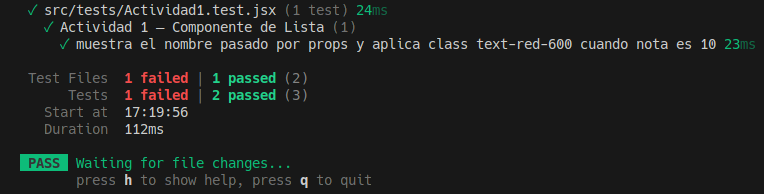
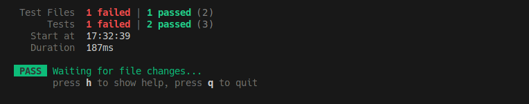
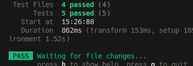
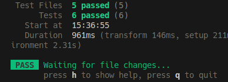
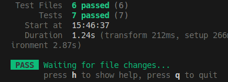
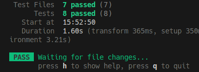
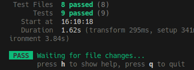
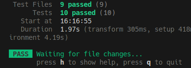
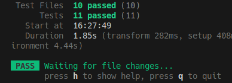
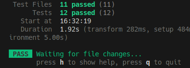

# Informe de Testing - [Emilio Garcia Muñoz]
## Actividad [1]

* **Reto:** Comprobar que el componente List muestra el nombre de la pelicula pasado por props, y que si la pelicula tiene una nota de 10, el titulo aparece en rojo

* **Prompt IA:** A la IA le he pasado el contexto de el proyecto y le he dicho: 

Anatomía de un Test: El Patrón AAA
Todos los tests de las actividades seguirán este esquema:

Arrange (Preparar): Renderizamos el componente (usando render y, si es
necesario, MemoryRouter).
Act (Actuar): Si es necesario, simulamos la interacción del usuario (escribir,
clicar) usando user-event.
Assert (Afirmar): Comprobamos que el resultado es el esperado (usando
expect).
teniendo esto en cuenta, haz lo siguiente explicandolo

Actividad 1 — Componente de Lista

Comprueba que el componente List muestra correctamente el nombre pasado por props y que, si la película tiene una nota de 10, el título aparece en color rojo (clase text-red-600).

* **Explicación del Test:** Con el arrange selecciona la pelicula con nota 10 desde el array y la renderiza usando render(), con el assert usa la funcion getByText() con el nombre para ver donde esta el titulo que se muestra y con ese titulo comprueba que esta en el documento y que el elemento tiene el texto en rojo cuando la nota es 10.

> 

## Actividad [2]

* **Reto:** Verificar que List renderiza correctamente el contenido que se le pasa por children, comprobando si la imagen tiene un alternativo correcto basado en el nombre del interprete o la pelicula.

* **Prompt IA:** La IA ya sabe el contexto del proyecto y le he dicho lo siguiente: 

Ahora que sabes como es mi proyecto, haz el siguiente test paso a paso y comentandolo para entenderlo:

Actividad 2: Texto Dinámico y Accesibilidad

Verifica que el componente List renderiza correctamente el contenido que se le pasa a través de children (recuerda que se usa para la clasificación o biografía) y comprueba que la imagen tiene el atributo alt correcto basado en el nombre del intérprete o de la película.

* **Explicación del Test:** Con el arrange selecciona una pelicula real del array, obtiene el nombre la cartelera y la clasificación/resumen y luego los renderiza, con el Assert localiza el texto pasado por children y solo busca el elemento 
 para evitar que coincida con el figcaption usando la funcion getByText() y comprueba que existe y esta visible, luego localiza la imagen con getByAltText() y comprueba que existe y tiene los atributos alt correctos y src apunta a la URL esperada.

Las funciones son las siguientes:

expect(...).toBeInTheDocument(): Comprueba que el elemento existe en el DOM de la prueba.

expect(...).toBeVisible(): Verifica que el elemento es visible para el usuario.

expect(...).toHaveAttribute(): Comprueba que el elemento tiene el atributo y el valor que le pasamos.

> 

## Actividad [3]

* **Reto:** Verificar que en formulario si un usuario intenta enviar este sin nombre, aparece el mensaje de que es obligatorio.

* **Prompt IA:**  
Actividad 3: Validación de "Nombre obligatorio" (Formulario Controlado).

En FormularioPeliculaControlado.jsx, verifica que, si el usuario intenta enviar el formulario con el nombre vacío, aparece el mensaje "El nombre es obligatorio".

haz un test para esto explicandolo y comentandolo para que lo entienda

* **Explicación del Test:** Primero con el Arrange prepara el Formulario renderizando este, luego en el Act crea una constante para conseguir el boton de enviar, por ultimo en el Assert simula que se le ha dado al boton, y verifica si el mensaje que sale de error es que el nombre es obligatorio.

Las funciones utilizadas son las siguientes:

expect(...).toBeInTheDocument(): Comprueba que el elemento existe en el DOM de la prueba.

> 

## Actividad [4]

* **Reto:** Verificar que en el formulario de interprete, si la biografia es menor del minimo de caracteres que hay, aparezca el error "La biografia debe tener al menos 50 caracteres".

* **Prompt IA:**  
Actividad 4: Longitud de Biografía en Intérpretes

En FormularioInterprete.jsx, valida que, si la biografía tiene menos de 50 caracteres, aparece el error: "La biografía debe tener al menos 50 caracteres".

vamos con este, comentado para que lo entienda 

* **Explicación del Test:** Primero que todo en test ponemos async, ya que userEvent es asincrono necesitamos esto para que funcione bien. 

En el Arrange inicializamos el simulador del usuario y luego renderizamos el componente, en el Act primero buscamos el campo "Biografia", despues simulamos que el usuario introduce en ese campo un texto demasiado corto, simulamos que el usuario hace clic en el boton de enviar y por ultimo simulamos el clic real del raton en el boton de enviar, en el Assert comprobamos que aparece el mensaje de error que esperabamos.

Las funciones son las siguientes:

expect(...).toBeInTheDocument(): Comprueba que el elemento existe en el DOM de la prueba.

expect(...).toHaveAttribute(): Comprueba que el elemento tiene el atributo y el valor que le pasamos.

> 

## Actividad [5]

* **Reto:** Verificar que tras introducir el titulo en el formulario y pulsar enviar, vuelve a estar vacio.

* **Prompt IA:**  

Actividad 5: Reset de Formulario

Verifica que al rellenar el título en el formulario controlado FormularioPeliculaControlado.jsx y pulsar enviar, el campo vuelve a estar vacío (reset).

vamos con este, comentado para que lo entienda 

* **Explicación del Test:** Primero que todo en test ponemos async, ya que userEvent es asincrono necesitamos esto para que funcione bien. 

Con el Arrange preparamos el simulador del usuario y renderizamos el componente, en el Act rellenamos todos los campos que hacen falta, ya que si dejamos uno vacio la validacion falla y no se vacian los campos al darle a enviar, por ultimo en el Assert simulamos que el usuario le ha dado al boton enviar.

Las funciones son las siguientes:

expect(...).toHaveValue(): Comprueba que el input de lo que le pases tiene el valor que pongas en toHaveValue(valor que esperas).

> 

## Actividad [6]

* **Reto:** Comprobar que el buscador que hay en Peliculas funciona aunque el usuario escriba en minusculas (Case Sensitive)

* **Prompt IA:**  
Actividad 6: Buscador de Películas (Case Insensitive)

Comprueba que el buscador en Peliculas.jsx funciona, aunque el usuario escriba en minúsculas (ej: "sexto" para encontrar "El sexto sentido").

vamos con este, comentalo bien para que lo entienda perfectamente 

* **Explicación del Test:** Primero que todo en test ponemos async, ya que userEvent es asincrono necesitamos esto para que funcione bien. 

En el Arrange inicializamos el simulador de un usuario y renderizamos el componente, como el componente tiene otro componente Link, hay que envolver el render de Peliculas en MemoryRouter, si no el test va a fallar diciendo que no puede usar Link fuera de un Router.

En el Act encontramos el input, que se define por el placeholder en Peliculas, con esto simulamos que el usuario ha escrito algo en ese input.

En el Assert hacemos dos verificaciones:

Verificacion 1: La pelicula correcta aparece con el texto que introduce el usuario, asi que esta visible en el documento.

Verificacion 2: Las otras peliculas no se tienen que mostrar, ya que queremos solo la pelicula con el input que hemos introducido, ninguna mas.

Las funciones son las siguientes:

expect(...).toBeInTheDocument(): Comprueba que el elemento existe en el DOM de la prueba.

expect(...).not.toBeInTheDocument(): Comprueba que el elemento no existe en el DOM de la prueba.

> 

## Actividad [7]

* **Reto:** Verificar que al buscar una pelicula que no existe, aparece el mensaje "No se encontraron peliculas con el termino pelicula".

* **Prompt IA:**  
Actividad 7: Mensaje de "No resultados"

Verifica que si buscas una película que no existe (ej: "Iron Man"), aparece el mensaje: "No se encontraron películas con el término Iron Man".

dime si te falta que te pase algo, en el caso de que no hazlo comentado para que lo entienda 

* **Explicación del Test:** Primero que todo en test ponemos async, ya que userEvent es asincrono necesitamos esto para que funcione bien. 

En el Arrange inicializamos el simulador de un usuario y renderizamos el componente, como el componente tiene otro componente Link, hay que envolver el render de Peliculas en MemoryRouter, si no el test va a fallar diciendo que no puede usar Link fuera de un Router.

En el Act buscamos el input, que es donde tenemos que simular que introducimos una pelicula que no existe y lo simulamos.

Por ultimo en el Assert verificamos que el mensaje de error existe usando el regex que usamos antes.

Las funciones son las siguientes:

expect(...).toBeInTheDocument(): Comprueba que el elemento existe en el DOM de la prueba.

expect(...).not.toBeInTheDocument(): Comprueba que el elemento no existe en el DOM de la prueba.

> 

## Actividad [8]

* **Reto:** Verificar que al hacer clic en una pelicula del listado, la URL cambia o se intenta cargar el componente de detalle.

* **Prompt IA:**  

Actividad 8: Navegación al Detalle

Simula un clic en una película del listado y verifica que la URL cambia o que se intenta cargar el componente de detalle.

vamos con este, comentalo bien, que se entienda cada cosa 

* **Explicación del Test:** Primero que todo en test ponemos async, ya que userEvent es asincrono necesitamos esto para que funcione bien.

En el Arrange inicializamos el simulador de un usuario, como necesitamo saber si cambia la URL hacemos un sistema de rutas con MemoryRouter que empieza en la pagina de inicio, en lugar de cargar el componente Detail completo, ponemos un h1 simple para verificar que se llega a Detalle.

En el Act buscamos una pelicula para clicar y hacemos clic en ella.

Por ultimo en el Assert verificamos que se ha cambiado de pantalla, para ello buscamos el elemento que pusimos en la segunda ruta, verificamos el texto y confirmamos por si acaso que ya no esta el listado de peliculas en pantalla.

Las funciones son las siguientes:

expect(...).toBeInTheDocument(): Comprueba que el elemento existe en el DOM de la prueba.

expect(...).not.toBeInTheDocument(): Comprueba que el elemento no existe en el DOM de la prueba.

expect(...).toHaveTextContent(): Comprueba que lo que le pases tenga el texto que tu quieres. 

> 

## Actividad [9]

* **Reto:** Testear que si entramos en una ruta, el componente detail muestra correctamente la pelicula que esta en esa ruta.

* **Prompt IA:**  

Actividad 9: Parámetros de Ruta en Detail.jsx

Testea que, si entramos en /detalle/pelicula/4, el componente Detail muestra correctamente la película "El silencio de los corderos”.

Dime si te falta algo y si no comentalo perfecto para que lo entienda 

* **Explicación del Test:** Hacemos juntos el Arrange y el Act, renderizamos el componente MemoryRouter y le decimos que la entrada inicial es "detalle/pelicula/4".

En el Assert confirmamos que sale el titulo principal que buscamos, ademas de el resumen y que no salga otra pelicula distinta.

Las funciones son las siguientes:

expect(...).toBeInTheDocument(): Comprueba que el elemento existe en el DOM de la prueba.

expect(...).not.toBeInTheDocument(): Comprueba que el elemento no existe en el DOM de la prueba.

> 

## Actividad [10]

* **Reto:** Verificar que los datos de error de validacion solo se envien al enviar, no al escribir.

* **Prompt IA:**  

El ultimo:

Actividad 10: Captura de Datos con Refs

En FormularioPeliculaNoControlado.jsx, comprueba que los datos no se validan al escribir, sino solo cuando se hace clic en el botón de enviar.

Dime si necesitas algo y te lo paso, si no comentalo todo perfecto que se entienda cada cosa 

* **Explicación del Test:** Primero que todo en test ponemos async, ya que userEvent es asincrono necesitamos esto para que funcione bien.

En el Arrange preparamos la simulacion de usuario y renderizamos el componente del FormularioPeliculaNoControlado.

En el Act vamos por partes, esta primera parte es cuando se introduce algo pero no se envia todavia, vamos a dejar el campo de nombre vacio para que salte error de validacion.

En el Assert tambien vamos por partes, en esta primera parte simplemente verificamos que aun no ha saltado ningun error de validacion.

En esta segunda parte del Act hacemos clic en el boton de enviar.

En esta segunda parte del Assert verificamos si hay error al darle clic al boton de enviar.

Las funciones son las siguientes:

expect(...).toBeInTheDocument(): Comprueba que el elemento existe en el DOM de la prueba.

> 
